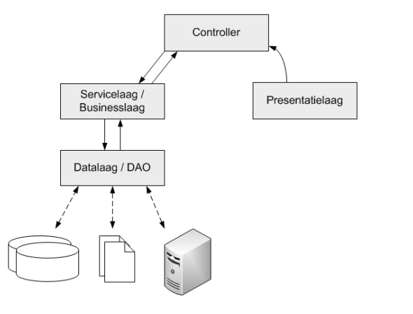

# MVC in a nutshell

*Dit voorbeeld legt uit hoe je een project volgens het MVC model kan maken*

### Getting started
- Clone dit project: https://github.com/BartRoosenCampus/mvc.git
- Open een terminal in de root folder (mvc) en voer een "composer update" uit.
- Ready to go!

### MVC explained

- De verschillende lagen (data, service, views, ...) bevinden zich in de "App" folder. Deze folder zal in werkelijkheid private zijn om je code af te schermen. De .htaccess file in de App folder gaat hiervoor zorgen.
- De controllers bevinden zich in de root-folder en zijn public (je kan er naar surfen). Het zijn deze controllers die de code binnen de App folder gaan aanspreken om uiteindelijk op het scherm te tonen wat er getoond moet worden.
- Een controller gaat via de servicelaag (businesslaag) data opvragen.
- De servicelaag (businesslaag) gaat deze data uit de datalaag opvagen en doorgeven aan de controller.
- Wanneer de data de controller bereikt heeft zal deze een view importeren en daze voorzien van de opgevraagde data.

